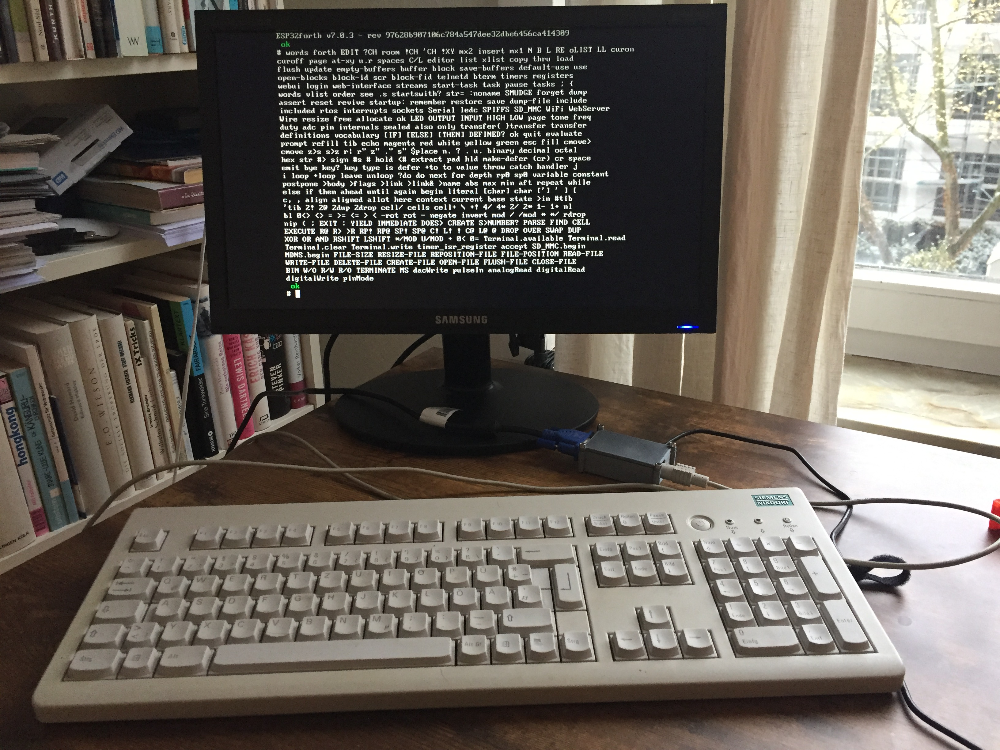
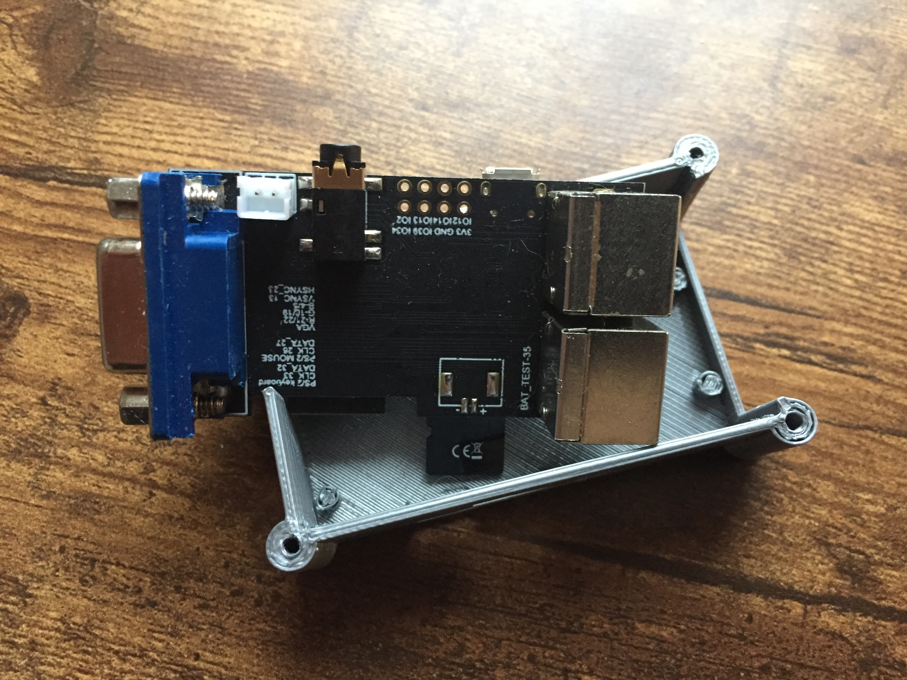

# ESP32forthStation
Stand alone Forth computer with LillyGo TTGO VGA32 single board computer and ESP32forth

---

Based on the work of several open source projects (see below) it was possible to make the _ESP32forthStation_. It is a single board Forth computer with keyboard (PS/2), video monitor (VGA) and networking capabilities (WiFi). It can be used as a complete development environment for your own experiments.

## Hardware

The ESP32forthStation hardware uses the

- [TTGO VGA32 board](http://www.lilygo.cn/prod_view.aspx?TypeId=50063&Id=1083) by [LillyGo](http://www.lilygo.cn), an ESP32 board with PS/2 Mouse, PS/2 keyboard, VGA video output, audio connectorm an micro SD card slot, some I/O pins as well as a 3.3V serial line. ESP32forthStation uses version V1.4 of that board.

- [TTGO VGA32 Case](https://www.thingiverse.com/thing:4675382) from thingiverse by [Neil Bowden](https://www.thingiverse.com/firepower9966/designs) 3D printed on a PLA filement printer.

## Software

ESP32forthStation is based on

- [FABGL library](http://www.fabglib.org/) by 
   [Fabrizio Di Vittorio](https://github.com/fdivitto), an Arduino based library for the ESP32 that contributes keyboard/monitor access and ANSI terminal capablilities to ESP32forthStation. FABGL has a lot of additional features and uses the TTGO VGA32 board (among others) for many other applications worth investigating. See the [FABGL home page](http://www.fabglib.org/) for details.

- [ESP32forth](https://esp32forth.appspot.com/ESP32forth.html) by 
   [Brad Nelson](https://github.com/flagxor), a modern Arduino based interactive Forth implementation with block and stream file support, networking with embedded Web-Server, access to hardware and ESP32 libraries/device drivers. See the 
   [ESP32forth home page](https://esp32forth.appspot.com/ESP32forth.html) for details.

The firmware of ESP32forthStation is a snapshot of ESP32forth augmented with appropriate calls to the FABGL library for I/O. This repostory provides released versions that are updated from time to time. Development takes place in the [VGA32 branch of my ueforth fork](https://github.com/uho/ueforth/tree/VGA32) of 
[Brad Nelson original ueforth repository](https://github.com/flagxor/ueforth).

### Flashing the firmware

In order flash the ESP32forthStation firmware to the TTGO VGA32 Board use the Arduino IDE, select the board in the Arduino board manager and upload the file [ESP32forth.ino](src/ESP32forth.ino). If in doubt please check the installation instruction on the [ESP32forth home page](https://esp32forth.appspot.com/ESP32forth.html)</a>.

## Licensing

The code in this repository is licensed under the terms of the GNU GENERAL PUBLIC LICENSE unless stated otherwise. The different contributing projects might have different licensing conditions. Please check with the appropriate repositories.

## _We're dwarfs standing on the shoulders of giants._

Contributions go to those who made this project possible (Brad Nelson, Fabrizio Di Vittorio, the engineers at LillyGo, Neil Bowden and many others who did earlier work ...)

### Contact

If you have any questions or issues regarding this project please contact me.

Ulrich Hoffmann uho@xlerb.de

---

## Journal

- 2023-02-10 Publication of this repository

- 2022-12-10 [Presentation of ESP32forthStation](doc/So_this_is_Christmas-ESP32forthStation.pdf) 
at the international Zoom meeting of the [Forth2020 group](https://www.forth2020.org/)</a>. A recording of the talk [So this is Christmas - ESP32forthStation](https://www.youtube.com/watch?v=glMhQdNSmCc) is available at youtube.

